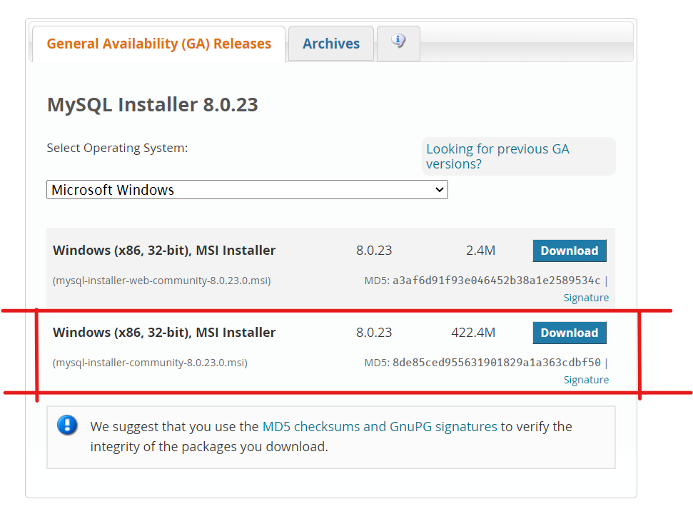
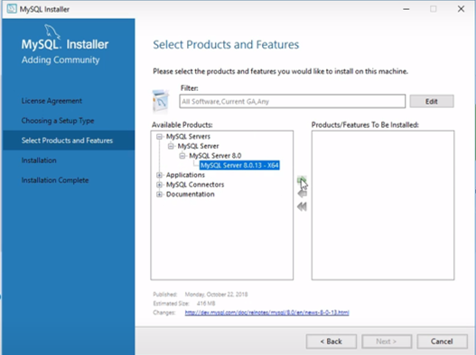

# Contributing to Breads Server

We love your input! We want to make contributing to this project as easy and transparent as possible, whether it's:

-   Reporting a bug
-   Discussing the current state of the code
-   Submitting a fix
-   Proposing new features
-   Becoming a maintainer

## Before you contribute

Our aim is to **keep it simple** for the developers to contribute to this project. See the folder structure (with concise description)

## How to contribute

1. First up you need to fork (make a copy) of this repo to your Github account.

2. Clone (download) your fork to your computer

3. Set your streams so that you can sync your clone with the original repo (get the latest updates)

    - `git remote add upstream https://github.com/zero-to-mastery/breads-server.git`
    - `git pull upstream master`
    - The above 2 commands will synchronize your forked version of the project with the actual repository.

4. Create a branch `git checkout -b <your_branch_name>`.

<details>
<summary>5. Setup MySQL on your local machine</summary>

Create a local mySQL database.

**For Windows:**

If you are installing mySQL for the first time follow the following steps.

-   Download mySQL `mysql-installer-community-8.0.23.0.msi` from [here](https://dev.mysql.com/downloads/windows/installer/8.0.html).



-   Open the installer, agree with the licence and choose custom installer option and press next.
-   Select Product and Features




and then click on Next.

-   Click on next till you reach Authentication Method, in Authentication Method choose
    `Use Legacy Authentication Method`
-   Set password for the root. And click on Next till the installation will finish.

-   Now open the MySQL Workbench and create a database with `CREATE DATABASE bread_server` and use it with `USE bread_server`

</details>

1. Import seed data (Before this step database must be created see **step 5 last point**)

    - From Shell

        - `mysql -u [USERNAME] -p [DATABASE] < mysql/tables.sql` - create tables
        - `mysql -u [USERNAME] -p [DATABASE] < mysql/import.sql` - import data

    - From Workbench
        - copy the entire file `tables.sql` and execute ⚡ the command at once.
        - copy the entire file `import.sql` and execute ⚡ the command at once.

2. Create a file `.env` in the root directory:

    - `LOCAL_CORS` - frontend url (i.e. 'http://localhost:3000')

        **MySQL**

    - `LOCAL_HOST` - local MySQL hostname
    - `LOCAL_USER` - local MySQL username
    - `LOCAL_DBPASSWORD` - local MySQL password
    - `LOCAL_DB` - local MySQL database name

    **JWT** - create a secret key for JWT based authentication

    - `SECRET_KEY` - JWT secret key

    **[Cloudinary](https://cloudinary.com/)** - Used for image hosting. Set up a free account to get a cloud name, API key, and API Secret _(only needed if working on user CRUD)_

    - `CLOUDINARY_CLOUD_NAME` - Cloud Name
    - `CLOUDINARY_API_KEY` - API Key
    - `CLOUDINARY_API_SECRET` - API Secret

    **[Link Preview](https://www.linkpreview.net/)** - Used as a fallback for the webscraper. Set up a free account to get an API key _(only needed if working on webscraper)_

    - `LINK_PREVIEW_KEY` - API Key

    **Nodemailer** - Used to send password reset emails. Add an email login information _(only needed if working on reset password feature)_

    - `EMAIL_LOGIN` - email address
    - `EMAIL_PASSWORD` - email password
    - `EMAIL_URL` - frontend url (i.e 'http://localhost:3000')
    - At the end `.env` file will look like this:

        ```md
        PORT=3030

        LOCAL_HOST=localhost
        LOCAL_USER=<YOUR_MYSQL_USERNAME>
        LOCAL_DBPASSWORD=<YOUR_MYSQL_PASSWORD>
        LOCAL_DB=bread_server

        CLOUDINARY_CLOUD_NAME=<YOUR_CLOUDINARY_CLOUD_NAME>
        CLOUDINARY_API_KEY=<YOUR_CLOUDINARY_API_KEY>
        CLOUDINARY_API_SECRET=<YOUR_CLOUDINARY_API_SECRET>

        SECRET_KEY=thisisasecretkey

        LINK_PREVIEW_KEY=<YOUR_CLOUDINARY_CLOUD_NAME>

        LOCAL_CORS=http://localhost:3000
        ```

3. Install the necessary dependencies using [npm](https://docs.npmjs.com/about-npm/) or [yarn](https://yarnpkg.com/getting-started).

    To install the packages through npm, run the command `npm install`

    To install the packages through yarn, run the command `yarn add`

    NOTE: In the rest of the documentation, you will come across npm being used for running commands. To use yarn in place of npm for the commands, simply substitute npm for yarn. Example, `npm start` as `yarn start`. For more help, checkout [migrating from npm](https://classic.yarnpkg.com/en/docs/migrating-from-npm/).

4. Run `npm install`

5. Start making your changes.

6. Get a screenshot of your finished work! (if there are any UI changes) Try to crop it so that it looks good as a smallish (preferably squarish) image.

7. Pull from the upstream again before you commit your changes, like you did in step 3. This is to ensure your still have the latest code.

8. If you see a error like

```md
Your local changes to the following files would be overwritten by merge. Please commit your changes or stash them before you merge
```

on using `git pull upstream main` use:

-   `git stash`
-   `git pull upstream main`
-   `git stash pop`

    for more info on this [visit](https://bluecast.tech/blog/git-stash/)

14. Commit and push the code to your fork

15. Create a pull request to have the changes merged from your fork into the origin.

### Folder Structure

## We Use [Github Flow](https://guides.github.com/introduction/flow/index.html), So All Code Changes Happen Through Pull Requests

Pull requests are the best way to propose changes to the codebase (we use [Github Flow](https://guides.github.com/introduction/flow/index.html)). We actively welcome your pull requests:

1. Fork the repo and create your branch from `main`.
2. If you've added code that should be tested, add tests.
3. If your change needs an explaination to the user, update the documentation.
4. Ensure the test suite passes.
5. Make sure your code lints.
6. Issue that pull request!

## Any contributions you make will be under the MIT Software License

In short, when you submit code changes, your submissions are understood to be under the same [MIT License](http://choosealicense.com/licenses/mit/) that covers the project. Feel free to contact the maintainers if that's a concern.

## Report bugs using Github's [issues](../../issues)

We use GitHub issues to track public bugs. Report a bug by [opening a new issue](../../issues); it's that easy!

## Write bug reports with detail, background, and sample code

**Great Bug Reports** tend to have:

-   A quick summary and/or background
-   Steps to reproduce
    -   Be specific!
    -   Give sample code if you can.
-   What you expected would happen
-   What actually happens
-   Notes (possibly including why you think this might be happening, or stuff you tried that didn't work)

People _love_ thorough bug reports. I'm not even kidding.

## Use a Consistent Coding Style

Observe the coding style of the project and add your code also in the same style.
**Don't make major changes** (Like changing the complete folder structure)

## License

By contributing, you agree that your contributions will be licensed under its MIT License.
